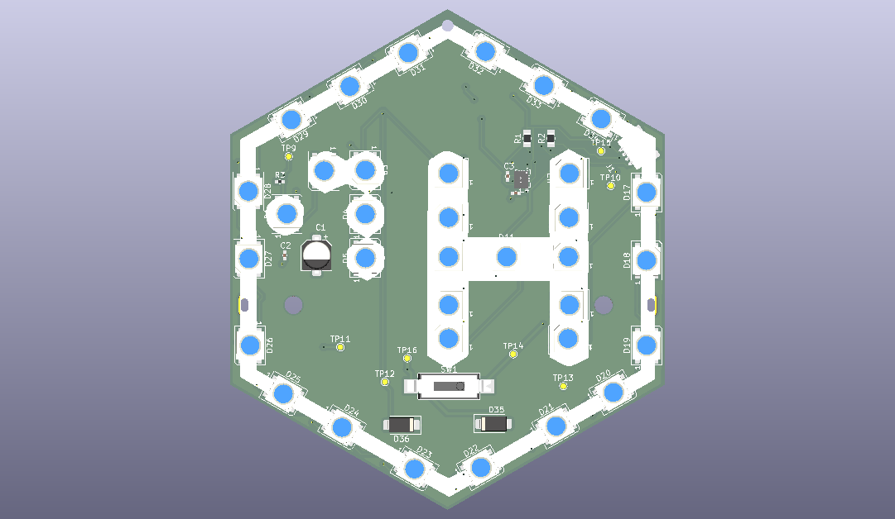
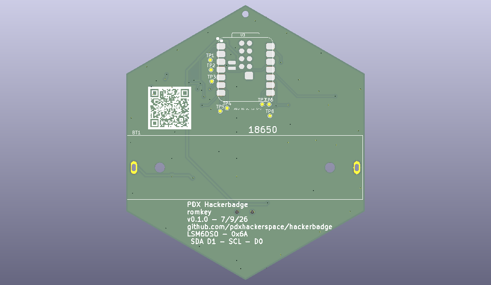

# PDX Hackerspace Hackerbadge

[](https://github.com/pdxhackerspace/hackerbadge/actions/workflows/ci.yml)

The unofficial badge of PDX Hackerspace.

- 37 WS2812B addressable RGB LEDs
- SeeedStudio Xiao ESP32-S3 (8MB PSRAM/8MB flash)
- LSM6DSO accelerometer/gyroscope
- 18650 LiPO battery
- Qwiic/STEMMA QT I2C connector

Though we've specced this for a Xiao ESP32-S3, this should work with any Xiao board with a compatible pinout. If the board doesn't support LiPO battery charging then obviously it will only work when plugged into USB.

 

## LED power

LEDs are powered either through the VBUS or VBAT, avoiding straining the board's 3.3V regulator and providing more voltage to them for more reliable operation. We use two SS23 Schottky diodes to OR the power sources together and avoid feeding back into one another.

## LED control

Xiao ESP32-S3 D10 controls the LEDs.

## Qwiic/STEMMA QT/I2C

SDA - D1
SCL - D0

## Accelerometer/Gyroscope

The board includes an LSM6DSO accelerometer/gyroscope for fancy effects, or you can just ignore it. I2C address 0x6A.

## Firmware

Hardware self-test sketches live under `firmware/test/`. They cycle LED colors/patterns and exercise the LSM6DSO. Production-style options (WLED, ESPHome, CircuitPython) are below.

### WLED

1. Hold the Xiao **BOOT** button, plug in USB, then release BOOT so the board is in download mode.
2. Open the [WLED web installer](https://install.wled.me/) (or [alternate installer](https://wled-install.github.io/)) in Chrome/Edge.
3. Choose an **ESP32-S3** build that matches this board: **8MB flash** and **PSRAM** (OPI / `qio_opi` style binaries are the usual fit for the Xiao ESP32-S3). Flash it.
4. Join Wi‑Fi AP `WLED-AP` (password `wled1234`) and open [http://4.3.2.1](http://4.3.2.1).
5. **Config → LED Preferences** and set:
   - LED count / length: **37**
   - GPIO / data pin: **9** (Xiao **D10**)
   - LED type: **WS281x**
   - Color order: **GRB**
6. Save, then optionally configure your home Wi‑Fi under **Config → WiFi Setup**.

Stock WLED does not use the LSM6DSO.

**Docker Compose** (build a badge-tuned binary with GPIO 9 / 37 LEDs preconfigured):

```bash
cd firmware/wled
docker compose run --rm build
```

Firmware ends up under `firmware/wled/build/`. Flash with the web installer, `esptool`, or:

```bash
DEVICE=/dev/ttyACM0 docker compose run --rm --device=$DEVICE build upload
```

If the OPI-PSRAM build won’t boot, try `PIO_ENV=hackerbadge_qspi docker compose run --rm build`. See also [Compiling WLED](https://kno.wled.ge/advanced/compiling-wled/).

### ESPHome

Test config: `firmware/test/esphome/badge_test.yaml`

Requires an ESPHome release with the `motion` / `lsm6ds` platform. After flash, the badge cycles LED effects and logs IMU samples over serial. It also brings up AP `Hackerbadge-Test` (password `hackerspace`); open [http://192.168.4.1](http://192.168.4.1) for the web UI.

**Docker Compose** (dashboard on [http://localhost:6052](http://localhost:6052)):

```bash
cd firmware/test/esphome
docker compose up
```

Compile only, or compile and flash over USB:

```bash
docker compose run --rm esphome compile badge_test.yaml
DEVICE=/dev/ttyACM0 docker compose run --rm --device=$DEVICE esphome run badge_test.yaml
```

Without Docker: `esphome run firmware/test/esphome/badge_test.yaml`

### CircuitPython

Test program: `firmware/test/circuitpython/code.py`

1. Install [CircuitPython for Seeed Xiao ESP32-S3](https://circuitpython.org/board/seeed_xiao_esp32s3/).
2. From the [Adafruit library bundle](https://circuitpython.org/libraries), copy into `CIRCUITPY/lib/`:
   - `neopixel.mpy` (and `adafruit_pixelbuf.mpy` if present in your bundle)
   - `adafruit_lsm6ds/`
   - `adafruit_bus_device/`
   - `adafruit_register/`
3. Copy `firmware/test/circuitpython/code.py` to `CIRCUITPY/code.py`.

Watch the serial REPL for IMU logs while LEDs cycle.

### Arduino

Test sketch: `firmware/test/arduino/badge_test/badge_test.ino`

**Docker Compose** (Arduino CLI build; artifacts in `firmware/test/arduino/build/`):

```bash
cd firmware/test/arduino
docker compose run --rm build
```

Upload over USB after a successful compile:

```bash
DEVICE=/dev/ttyACM0 docker compose run --rm --device=$DEVICE build upload
```

Without Docker:

1. In Arduino IDE, install board support for **Seeed XIAO ESP32S3**.
2. Install libraries: **FastLED**, **Adafruit LSM6DS** (pulls in BusIO and Unified Sensor).
3. Open the `badge_test` sketch, select the Xiao ESP32S3 board/port, and upload.

Serial Monitor at 115200 baud shows effect names and IMU readings.

## Assembly

The badge comes prebuilt except for the Xiao and the battery holder, which are mounted on the back of the board. We suggest soldering on the Xiao using solder paste and a hot air gun. You're unlikely to make a solder plate work due to the components on the front of the board. The most difficult part will be the battery connectors under the board.


